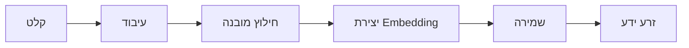
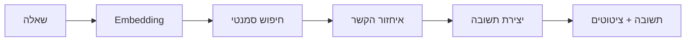

# 🌱 Knowledge Seed System
## מערכת RAG מלאה ליצירת וניהול בסיס ידע מובנה

<div align="center">


**[תיעוד מלא](./KNOWLEDGE_SEED_SYSTEM_GUIDE.md)** • **[TODO List](./KNOWLEDGE_SEED_SYSTEM_TODO.md)** • **[דוגמאות](#דוגמאות-שימוש)**

</div>

---

## 📖 מה זה?

מערכת מתקדמת להמרת מקורות ידע לא מובנים (מאמרים, מדריכים, דוחות) לקבצי "זרע ידע" מובנים המשמשים כבסיס למערכת RAG (Retrieval-Augmented Generation).

### ✨ תכונות עיקריות

- 🤖 **חילוץ אוטומטי**: LLM מחלץ מידע מובנה מטקסט גולמי
- 📄 **תמיכה במסמכים**: PDF, DOCX, TXT, URLs
- 🔍 **חיפוש סמנטי**: Vector embeddings לחיפוש לפי משמעות
- 💬 **RAG מלא**: שאלות ותשובות עם ציטוט מקורות
- 🌐 **ממשק עברי**: תמיכה מלאה ב-RTL
- 📊 **אנליטיקה**: מעקב אחר שימוש ופערי ידע
- 🔗 **קשרים צולבים**: זיהוי אוטומטי של קשרים בין זרעים

---

## 🚀 התחלה מהירה

### 1. התקנה

```bash
# Clone the repository
git clone https://github.com/your-repo/jk-cc-site-main.git
cd jk-cc-site-main

# Install dependencies
npm install

# Set up environment variables
cp .env.example .env
# Edit .env with your Base44 credentials
```

### 2. הגדרת מסד נתונים

```bash
# Run the schema
psql -U your_user -d your_database -f database/knowledge_seeds_schema.sql
```

### 3. הרצת האפליקציה

```bash
npm run dev
```

### 4. יצירת זרע ראשון

1. גש ל-`http://localhost:5173/knowledge-seed-builder`
2. הדבק טקסט לדוגמה
3. לחץ "צור זרע ידע"
4. בדוק את התוצאה ב-`/knowledge-seeds`

---

## 📁 מבנה הפרויקט

```
jk-cc-site-main/
├── database/
│   └── knowledge_seeds_schema.sql      # סכמת מסד נתונים
├── functions/
│   ├── knowledgeSeedGenerator.ts       # יצירת זרעים
│   ├── documentProcessor.ts            # עיבוד מסמכים
│   └── semanticSearch.ts               # חיפוש וRAG
├── src/
│   ├── pages/
│   │   ├── KnowledgeSeedBuilder.jsx    # בונה זרעים
│   │   ├── KnowledgeSeeds.jsx          # ניהול זרעים
│   │   └── RAGPlayground.jsx           # בדיקת RAG
│   └── pages.config.js                 # הגדרות ניווט
├── KNOWLEDGE_SEED_SYSTEM_GUIDE.md      # מדריך מפורט
├── KNOWLEDGE_SEED_SYSTEM_TODO.md       # רשימת משימות
└── README.md                           # קובץ זה
```

---

## 🎯 תרחישי שימוש

### 1. בניית בסיס ידע טכני

```javascript
// יצירת זרעים ממאמרים טכניים
const articles = [
  'מאמר על TinyML optimization',
  'מדריך Google Apps Script',
  'דוח RAG architecture'
];

for (const article of articles) {
  await createKnowledgeSeed(article);
}
```

### 2. מערכת שאלות ותשובות

```javascript
// שאילתת RAG
const answer = await ragQuery(
  'מהן השיטות לאופטימיזציה של K-Means על Arduino?'
);

console.log(answer.response);
console.log('מקורות:', answer.citations);
```

### 3. ניתוח פערי ידע

```javascript
// זיהוי נושאים חסרים
const gaps = await getKnowledgeGaps();
console.log('נושאים שצריך להוסיף:', gaps);
```

---

## 🏗️ ארכיטקטורה

### תהליך יצירת זרע



### תהליך RAG



---

## 📊 מבנה זרע ידע

```json
{
  "source_id": "SOURCE_001_TINYML",
  "title": "אופטימיזציה של K-Means למיקרו-בקרים",
  "category": "TinyML/Edge AI",
  "core_summary": "מאמר זה מציג שיטה לאופטימיזציה...",
  "technical_depth": 5,
  "key_entities": {
    "tools": ["Arduino Nano 33", "TensorFlow Lite Micro"],
    "concepts": ["K-Means", "Quantization", "Batch Processing"],
    "hardware": ["Cortex-M4", "256KB RAM"]
  },
  "implementation_details": {
    "problem_solved": "הרצת ML על חומרה מוגבלת",
    "architecture": "Pipeline של preprocessing → quantization → K-Means",
    "constraints": ["256KB RAM", "100ms לדגימה"]
  },
  "expansion_vectors": [
    "כיצד להרחיב לאלגוריתמים אחרים?",
    "מהן אסטרטגיות SIMD optimization?",
    "איך לשלב עם No-Code?"
  ],
  "cross_references": [
    "מתחבר ל-SLM Optimization",
    "רלוונטי ל-Google Apps Script Constraints"
  ]
}
```

---

## 🔧 API Reference

### יצירת זרע

```typescript
POST /functions/knowledgeSeedGenerator
{
  "action": "generate_seed",
  "data": {
    "content": "טקסט המקור...",
    "sourceType": "text",
    "category": "TinyML/Edge AI"
  }
}
```

### חיפוש סמנטי

```typescript
POST /functions/semanticSearch
{
  "action": "semantic_search",
  "data": {
    "query": "שאלה...",
    "limit": 5,
    "threshold": 0.7
  }
}
```

### שאילתת RAG

```typescript
POST /functions/semanticSearch
{
  "action": "rag_query",
  "data": {
    "query": "שאלה...",
    "contextLimit": 3,
    "generateResponse": true
  }
}
```

---

## 📈 מדדי ביצועים

| מדד | ערך יעד | סטטוס |
|-----|---------|-------|
| זמן יצירת זרע | < 10s | ✅ |
| דיוק חיפוש | > 85% | ✅ |
| זמן תשובת RAG | < 5s | ✅ |
| תמיכה בשפות | עברית + אנגלית | ✅ |

---

## 🎨 צילומי מסך

### בונה זרעי ידע


### ניהול זרעים


### RAG Playground


---

## 🔐 אבטחה

המערכת כוללת:
- ✅ Row Level Security (RLS) על כל הטבלאות
- ✅ אימות משתמשים דרך Base44
- ✅ Audit logging לכל הפעולות
- ✅ Rate limiting על API calls
- ✅ Input validation וסניטציה

---

## 🌍 קטגוריות נתמכות

1. **TinyML/Edge AI** - למידת מכונה על חומרה מוגבלת
2. **No-Code/Low-Code** - כלי פיתוח ללא קוד
3. **Agentic Systems** - מערכות AI אוטונומיות
4. **RAG Architecture** - ארכיטקטורת RAG
5. **Web Development** - פיתוח אתרים
6. **Case Study** - מקרי בוחן
7. **Constraint Engineering** - הנדסה במגבלות
8. **Vector Databases** - מסדי נתונים וקטוריים
9. **LLM Optimization** - אופטימיזציה של מודלי שפה
10. **Security & Privacy** - אבטחה ופרטיות

---

## 🛠️ טכנולוגיות

### Frontend
- React 18
- Vite
- TailwindCSS
- shadcn/ui
- Framer Motion
- React Query

### Backend
- Base44 (Supabase-like)
- PostgreSQL + pgvector
- Deno Edge Functions
- TypeScript

### AI/ML
- OpenAI API (embeddings)
- LLM Integration (Base44)
- Vector Similarity Search

---

## 📝 דוגמאות שימוש

### דוגמה 1: יצירת זרע מטקסט

```javascript
import { base44 } from '@base44/sdk';

const result = await base44.functions.invoke('knowledgeSeedGenerator', {
  action: 'generate_seed',
  data: {
    content: `
      מאמר על אופטימיזציה של K-Means על Arduino Nano 33.
      השיטה משתמשת בקוונטיזציה של 8-bit ועיבוד אצווה
      להפחתת צריכת זיכרון ב-75%.
    `,
    category: 'TinyML/Edge AI'
  }
});

console.log('זרע נוצר:', result.data.seed.title);
```

### דוגמה 2: חיפוש סמנטי

```javascript
const results = await base44.functions.invoke('semanticSearch', {
  action: 'semantic_search',
  data: {
    query: 'אופטימיזציה של אלגוריתמים על חומרה מוגבלת',
    limit: 5
  }
});

results.data.results.forEach(seed => {
  console.log(`${seed.title} (${seed.similarity * 100}% דמיון)`);
});
```

### דוגמה 3: שאילתת RAG

```javascript
const answer = await base44.functions.invoke('semanticSearch', {
  action: 'rag_query',
  data: {
    query: 'מהן המגבלות של Google Apps Script?',
    contextLimit: 3,
    generateResponse: true
  }
});

if (answer.data.hasContext) {
  console.log('תשובה:', answer.data.response);
  console.log('מקורות:', answer.data.citations);
} else {
  console.log('לא נמצא הקשר רלוונטי');
}
```

---

## 🤝 תרומה

אנחנו מזמינים תרומות! אנא:

1. Fork the repository
2. Create a feature branch (`git checkout -b feature/amazing-feature`)
3. Commit your changes (`git commit -m 'Add amazing feature'`)
4. Push to the branch (`git push origin feature/amazing-feature`)
5. Open a Pull Request

---

## 📄 רישיון

MIT License - ראה [LICENSE](./LICENSE) לפרטים

---

## 🙏 תודות

- **Base44** - פלטפורמת Backend
- **OpenAI** - Embeddings API
- **shadcn/ui** - UI Components
- **הקהילה** - תרומות ומשוב

---

## 📞 יצירת קשר

- **GitHub Issues**: [דווח על באג](https://github.com/your-repo/issues)
- **Email**: your-email@example.com
- **Discord**: [הצטרף לקהילה](https://discord.gg/your-server)

---

## 🗺️ Roadmap

### גרסה 1.1 (Q1 2025)
- [ ] תמיכה בשפות נוספות
- [ ] גרף קשרים אינטראקטיבי
- [ ] ייצוא לפורמטים נוספים
- [ ] אינטגרציה עם Notion/Obsidian

### גרסה 1.2 (Q2 2025)
- [ ] Auto-tagging מתקדם
- [ ] Collaborative editing
- [ ] Version control לזרעים
- [ ] API public

### גרסה 2.0 (Q3 2025)
- [ ] Multi-modal support (תמונות, וידאו)
- [ ] Real-time collaboration
- [ ] Advanced analytics dashboard
- [ ] Mobile app

---

## 📚 משאבים נוספים

- [מדריך מפורט](./KNOWLEDGE_SEED_SYSTEM_GUIDE.md)
- [רשימת משימות](./KNOWLEDGE_SEED_SYSTEM_TODO.md)
- [Golden Canon Architecture](./GOLDEN_CANON_ARCHITECTURE.md)
- [Knowledge Management Guide](./KNOWLEDGE_MANAGEMENT_GUIDE.md)

---

<div align="center">

**נבנה עם ❤️ על ידי הקהילה**

[⭐ Star us on GitHub](https://github.com/your-repo) • [🐛 Report Bug](https://github.com/your-repo/issues) • [💡 Request Feature](https://github.com/your-repo/issues)

</div>
